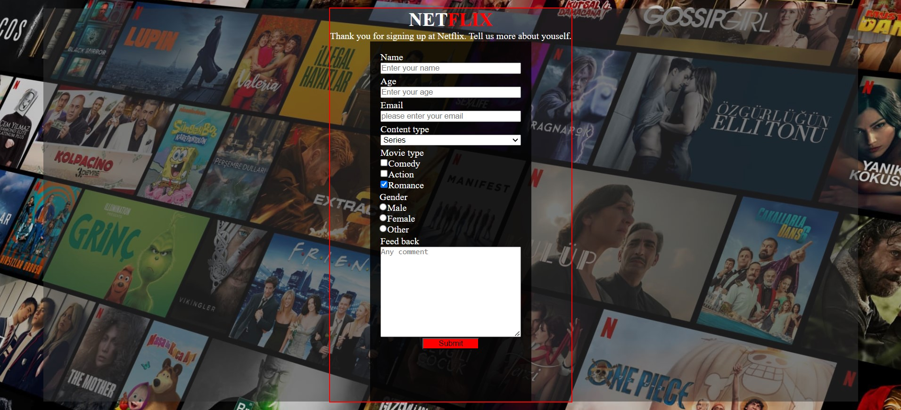

# Netflix Sign-Up Form

Welcome to the Netflix sign-up form page. This page allows users to provide information about themselves to personalize their Netflix experience.

## Technologies Used

- HTML5
- CSS3

## Live Demo

You can view the live demo of the Netflix sign-up form [here](https://netflix2-pi.vercel.app/).

## Description

This page presents a sign-up form for users who have just signed up for Netflix. Users can provide their name, age, email, preferred content type (series or movie), preferred movie genres, gender, and feedback.

## Usage

1. Fill in your name, age, and email address.
2. Select your preferred content type (series or movie).
3. Check your preferred movie genres.
4. Select your gender.
5. Provide any additional feedback or comments.
6. Click the "Submit" button to complete the form.

## Screenshots

## Installation

To run the Netflix sign-up form locally, follow these steps:

1. Clone this repository to your local machine.
2. Open the `index.html` file in your web browser.

## License

This project is licensed under the MIT License - see the [LICENSE](LICENSE) file for details.

